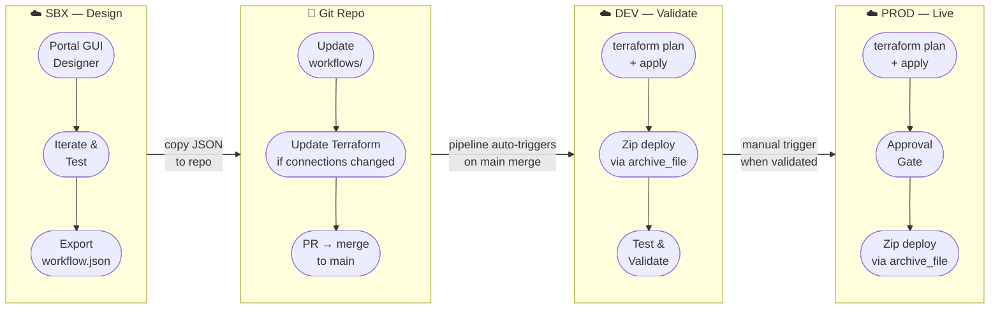

# Logic App Workflow Development Lifecycle

## Environment Roles

| Environment | Purpose | Deployment |
|---|---|---|
| **SBX** | GUI designer — build and iterate workflows using the portal; no pipeline | Manual (portal) |
| **DEV** | Terraform deployment testing — validates IaC changes before prod | Auto on `main` merge |
| **PROD** | Live environment — identical Terraform config, different `.tfvars` | Manual trigger + approval gate |

## Key Rules

- **SBX is the only environment where the portal designer is used.** Workflows built here are exported as `workflow.json` and committed to the repo.
- **SBX is never deployed from Terraform** — it exists purely for GUI-based development.
- **DEV and PROD are identical in structure** — same Terraform code, different `environments/*.tfvars` (resource names, email recipients, workspace targets).
- **Workflow zip deploy happens automatically inside `terraform apply`** — no separate pipeline stage needed.
