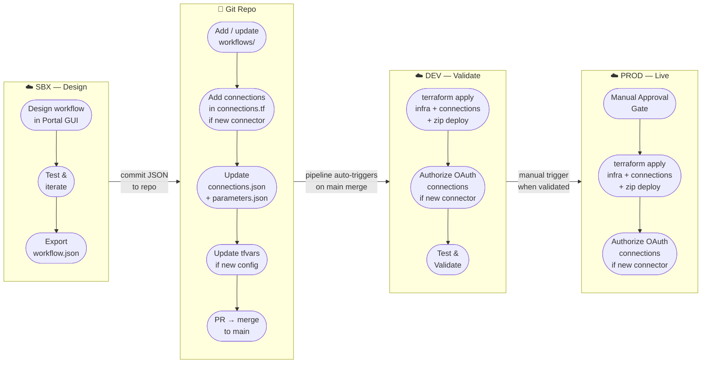

# Logic App Workflow Development Lifecycle

## Environment Roles

| Environment | Purpose | Deployment |
|---|---|---|
| **SBX** | GUI designer — build and iterate workflows using the portal; no pipeline | Manual (portal only) |
| **DEV** | Terraform deployment testing — validates IaC and workflow changes before prod | Auto on `main` merge |
| **PROD** | Live environment — identical Terraform config, different `.tfvars` | Manual trigger + approval gate |

## Key Rules

- **SBX is the only environment where the portal designer is used.** Workflows built here are exported as `workflow.json` and committed to the repo.
- **SBX is never deployed from Terraform** — it exists purely for GUI-based development.
- **DEV and PROD are identical in structure** — same Terraform code, different `environments/*.tfvars` (resource names, email recipients, workspace targets).
- **Zip deploy is part of `terraform apply`** — `archive_file` zips `workflows/` at plan time; `terraform_data` runs `az functionapp deployment source config-zip` only when workflow content changes (hash-based). No separate pipeline stage.
- **OAuth connections** (e.g. Office 365) need one-time manual portal authorization per environment after first `terraform apply`. The runtime URL is already set by Terraform; only the consent step is manual.
